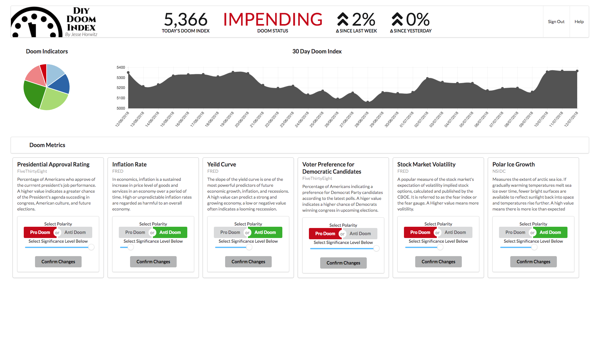

## DIY Doom Index
DIY Doom Index uses macroeconomic, political and environmental data to create a daily index of doom and turmoil. Users can weight and enable provided datasets that will contribute to a calculated doom value. [See working demo here.](https://doom-index.herokuapp.com) (Demo may take a few mins to start up) The front end was built using React, chart.js, JWT and Semantic UI in addition to a number of other packages identified in the yarn.lock file. Data retrieved in the Rails backend from FiveThirtyEight, FRED and NSIDC. Model relationships stored with Postgres. [Frontend](https://github.com/SuperJesseH/diy_doomsday)

## Build status
Front end: Check master branch for current working version
 
Backend: Master
## Screenshots

## Installation
<code>git clone https://github.com/SuperJesseH/diy_doomsday_backend</code>
 
<code>cd diy-doomsday-backend</code>
 
<code>rails db:create db:migrate db:seed</code>
 
<code>rails s</code>

FRED api key and JWT key must be set in a .env file

## Credits
Built by
[Jesse Horwitz](https://github.com/SuperJesseH)

## License
MIT ©
